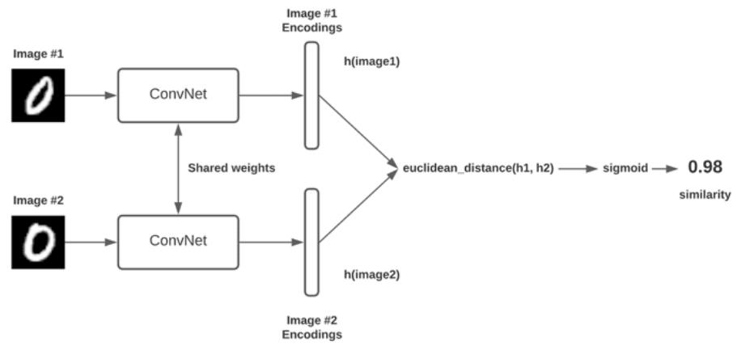
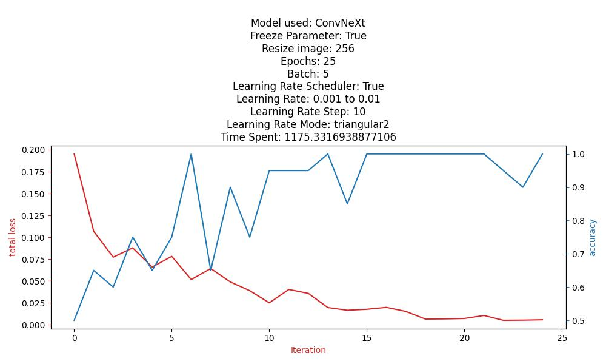
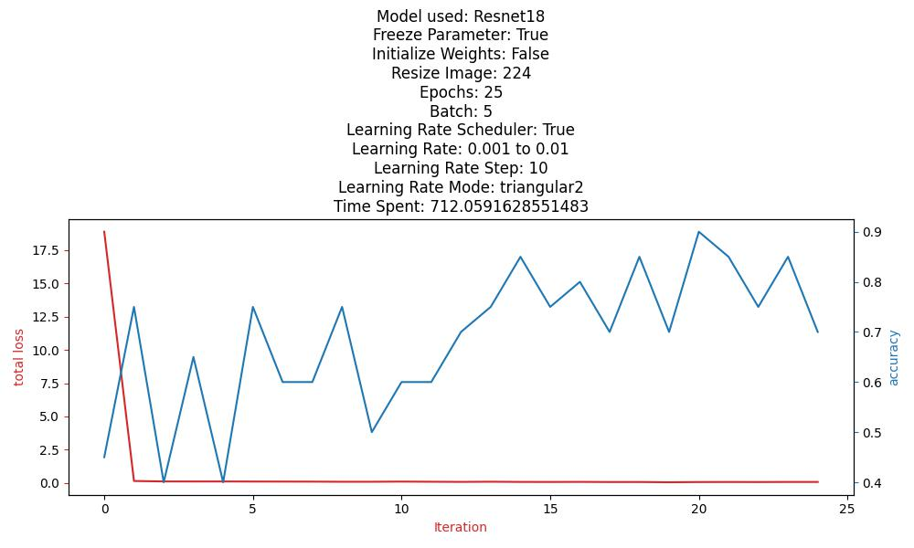

<h1 align="center">Schematics Comparator</h1>

 
With ConvNeXt model based Siamese Network

<h3 align="center">Background</h3>

 
During computer hardware development, circuit schematics documentation with hundreds of pages is updated on a regular basis. 
It is very difficult for hardware engineers to find the difference between two versions of schematics documentation.

<h3 align="center">Challenge</h3>

The idea is to distinguish the difference between two versions of schematics documentation that are originally

However, methods such as classical Mean Squared Error and Image Matching algorithms can not solve this problem due to the complex nature of large-scale circuit schematics. For example, a schematic layout can be changed but still represent the same circuit. Thus, the traditional image comparison method is not compatible with such task.

<h3 align="center">Solution</h3>

Because of the adaptivity and ability to identify similarities between images, machine learning is the most suitable method for solving this problem. Machine learning models can learn the schematics patterns to correctly distinguish whether two schematics represent the same logic or not.

<h3 align="center">Specific Machine Learning Method</h3>

A Samese Network is designed to identify the similarity between two images. It is a neural network that consists of two identical subnetworks meaning that they contain the same parameters and weights. Each subnetwork can be any neural network designed for images like a Convolutional Neural Network.

 

The network’s input is a pair of images that are either similar (positive example) or not similar (negative example). The network's output is the two feature vectors, one for each image. 

If the input pairs are similar, we want these two vectors to be as close as possible and vice versa. To achieve this, we use the contrastive loss function that takes a pair of vectors (x_i, x_j) and minimizes their Euclidean distance when they come from similar images while maximizing the distance otherwise.

Siamese Network

<h3 align="center">Model Used in the Siamese Networks</h3>

The pre-trained ConvNeXt model is chosen to construct the Siamese Networks. And the pre-trained Resnet18 model is used to construct the same SIamese Networks as a comparison with the ConvNeXt model.

The ConvNeXt model was proposed in A ConvNet for the 2020s by Zhuang Liu, Hanzi Mao, Chao-Yuan Wu, Christoph Feichtenhofer, Trevor Darrell, Saining Xie. ConvNeXT is a pure convolutional model (ConvNet), inspired by the design of Vision Transformers, that claims to outperform them.

<h3 align="center">Datasets for Model Fine-tuning</h3>

A custom dataset is created with the actual circuit schematics documentation that are in the current computer development.

There are 21 different classes prepared. The same class has different variations of schematics that represent the same logic, the different classes have schematics that are either on the same page of the PDF but represent different logics or from a different page of the PDF.

<h3 align="center">ConvNeXt and Resnet18 Fine-tune Rusults</h3>

By comparing with the Resnet18 model, the ConvNeXt model can achieve a stable out-of-sample accuracy of more than 90% in 10 epochs, and its training loss can reach less than 2.5% at 15 epochs. The Resnet18 model, on the other hand, has out-of-sample accuracy fluctuating, and can not maintain a stable high out-of-sample accuracy, and its training loss is still around 6% after 25 epochs.

<b>Best Results Settings for both Models</b>

| ConvNeXt | Resnet18 |
|:-------------------------:|:-------------------------:|
  |  

<h3 align="center">Conclusion</h3>

This ConvNeXt model-based Siamese Model has proven its ability to accurately disdinguish the similarity between two complex schematics documents, and it has been deployed to the actual computer hardware development team. 

## Catalog

| Description | Links |
|:---|:---:|
| Siamese Networks with ConvNeXt model | [Link](With_ConvNeXt.py) |
| Siamese Networks with Resnet18 model | [Link](With_ResNet.py) |
| Fine-tune and validation results | [Link](With_ResNet.py) |

## Reference

[A ConvNet for the 2020s Paper](https://arxiv.org/abs/2201.03545)

[ConvNeXt Github by Facebook Research](https://github.com/facebookresearch/ConvNeXt)

[ConvNeXt Hugging Face](https://huggingface.co/docs/transformers/main/model_doc/convnext)

