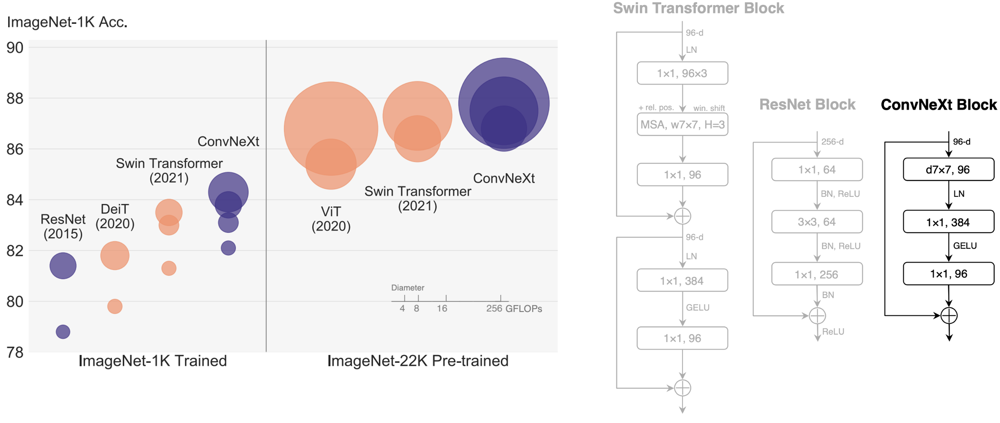

<h1 align="center">Schematics Comparator</h1>

 
With ConvNeXt model based Siamese Network

<h3 align="center">Background</h3>

 
During computer hardware development, circuit schematics documentations with hundreds of pages are updated in a regular basis. 
It is very difficult for hardware engineers to find the difference between two versions of schematics documentations.

<h3 align="center">Challenge</h3>

The idea is to disdinguish the difference between two versions of schematics documentation that is originally in the format of PDF.

However, methods such as classical Mean Squred Error and Image Matching algorithms can not solve this problem due to the complex nature of large scale circuit schematics. For example, a schematic layout can be changed but still representing the same circuit. Thus, traditional image comparison method is not compatible for such task.

<h3 align="center">Solution</h3>

Because of the adaptivity and ability to identify similarities between images, machine learning is the most suitable method for solving this problem. Machine learning model can learn the schematics patterns supervisely to correctly distinguish whether two schematics are the representing the same logic or not.

<h3 align="center">Specific Machine Learning Method</h3>

A Samese Networks is desgined to identify the similarity of two images. It is a neural network that consists of two identical subnetworks meaning that they contain exactly the same parameters and weights. Each subnetwork can be any neural network designed for images like a Convolutional Neural Network. 

The network’s input is a pair of images that are either similar (positive example) or not similar (negative example). The network's output are the two feature vecotrs, one for each image. 

If the input pairs are similar, we want these two vectors to be as close as possible and vice versa. To achieve this, we use the contrastive loss function that takes a pair of vectors (x_i, x_j) and minimizes their euclidean distance when they come from similar images while maximizing the distance otherwise.

Siamese Network

<h3 align="center">Model Used in the Siamese Networks</h3>

The pre-trained ConvNeXt model is choosed to construct the Siamese Networks. And the pre-trained Resnet18 model is used to construct the same SIamese Networks as a comparison with the ConvNeXt model.

The ConvNeXt model was proposed in A ConvNet for the 2020s by Zhuang Liu, Hanzi Mao, Chao-Yuan Wu, Christoph Feichtenhofer, Trevor Darrell, Saining Xie. ConvNeXT is a pure convolutional model (ConvNet), inspired by the design of Vision Transformers, that claims to outperform them.

<h3 align="center">Datasets for Model Fine-tuning</h3>

A custom dataset is created with the actual circuit schematics documentations that are in the current computer development.

There are 21 different classes prepared. The same class has different variations of schematics that represent the same logics, the different classes have schematics that are either at the same page of PDF but represent different logics or from a different page of PDF.

<h3 align="center">ConvNeXt and Resnet18 Fine-tune Rusults</h3>

ConvNeXt model | Resnet model
:-------------------------:|:-------------------------:
  |  

